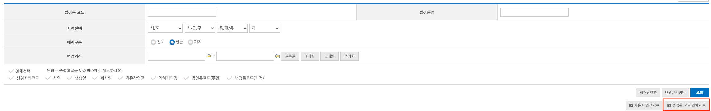
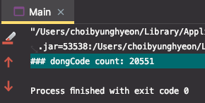

# 지역 데이터 분류

국가에서 제공하는 지역 데이터를 필요에 맞게 변환합니다.

## 사용 방법

> 법정동코드

1. [행정표준코드관리시스템](https://www.code.go.kr/index.do) 에서 `법정동 코드 전체자료` 를 다운받습니다.  
   이 자료에는 이미 폐지된 법정동도 포함되어 있습니다.
   

2. 다운로드 받은 파일을 `dongcode.txt` 로 이름 변경하여 프로젝트 루트 위치에 놓고 프로그램을 실행합니다.

3. 동일한 위치에 `존재하는 법정동` 만 파싱된  `parse_dongcode.csv` 가 생성되고 파싱된 row count 가 출력됩니다.
   
